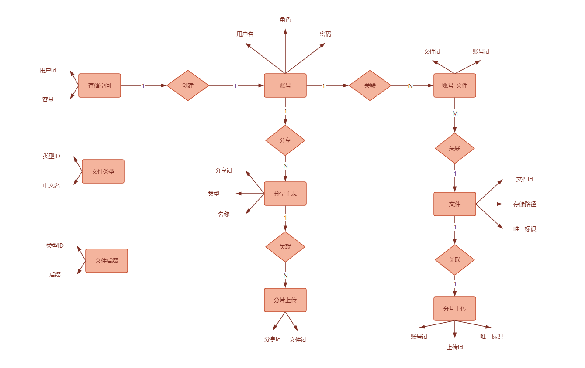
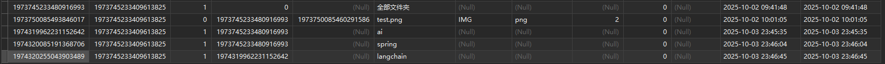

# sjdazcyth

数据档案一体化平台

# minio部署

```shell
docker run 
-d --restart=always 
--name minio 
--hostname minio-server -p 9000:9000 -p 9001:9001 
-v /minio/data:/bitnami/minio/data 
-e MINIO_ROOT_USER="minio_root" 
-e MINIO_ROOT_PASSWORD="minio_123456" 
-e MINIO_DEFAULT_BUCKETS="bucket" 
-e "MINI0_SERVER_URL=http://192.168.19.152:9000" 
bitnami/minio:2023.12.7
```

# AWS-S3对象存储服务API

AWS-S3通用存储协议介绍和项目依赖配置

● 什么是Amazon S3 ○ Amazon S3（Amazon Simple Storage Service）是亚马逊提供的一种对象存储服务，行业领先的可扩展性、数据可用性和性能 ○ 就类似阿里云OSS、七牛云OSS、MinIO等多个存储服务一样

● Amazon S3协议 ○ 是Amazon Simple Storage Service（简称Amazon S3）的接口规范 ○ 它是一种基于HTTP协议的RESTful API，用于访问Amazon Web Services（AWS）提供的对象存储服务 ○ S3-API: https://docs.aws.amazon.com/zh\_cn/AmazonS3/latest/API/API\_Operations\_Amazon\_Simple\_Storage\_Service.html ○ 支持阿里云OSS、七牛云OSS（对象存储服务） ■ 在一定程度上与Amazon S3协议兼容，可以使用S3 API来操作OSS多数操作 ■ 存在一些差异，如ACL权限定义、存储类型处理，需要单独处理

● 支持MinIO ○ 兼容Amazon S3协议的对象存储服务器，它提供了与Amazon S3完全相同的S3 API兼容性 ○ 在公共云、私有云中，MinIO支持广泛的S3 API，包括S3 Select和AWS Signature V4，复杂的查询和身份验证。 ○ Amazon S3构建的应用程序可以无缝迁移到MinIO，无需任何代码更改

# 文件秒传设计

真实文件和用户文件目录关系是分开的，真实文件存储后会返回一个唯一标识，然后用户与这个唯一标识关联。对于全盘而言，假设有相同的文件上传，可以实现秒传，因为盘内已存在该文件，而区分文件是否一样则通过这个唯一标识判断。

那么如何提取该唯一标识呢？

有几种方式，第一哈希函数，虽然能保证唯一性，但碰撞概率比较低，且计算消耗较高；

第二种基于文件内容生成，可能存在误判，不同文件产生相同的指纹，且计算消耗也高；

最后一种则是基于文件元数据组合，即通过文件大小、创建时间，修改时间。但可能存在不稳定，因为修改时间可能会随时改变

# 数据表关系



# 关于网盘容量和根目录初始化配置的设计思考

新用户注册，有默认网盘存储容量和根目录，那么这个是什么时候进行初始化呢？

答：可在用户注册时初始化网盘的存储空间，在简单场景中在代码中直接写死调用，但如果用户大对于场景丰富，可以使用消息队列。即用户注册时发送一个注册的消息，由网盘存储空间的消费者订阅消费，然后触发相关的业务，根目录初始化也可以放在此处初始化。举一反三，其他场景如折扣、拉新都可以通过消费这个消息来触发各自业务。

# 关于使用拦截器使用ThreadLocal传递用户信息

为了解决http的无状态用户信息传递的问题，和传统的web项目不同，传统项目可以通过session获取的方式获取当前请求的会话信息，进而提取用户信息。但对于前后端分离项目而言，就不能使用此种方式了。可以通过前端存储加密字符串，在后端解密，从而获取用户信息。这种加密方式也就是所使用的jwt签名令牌方式，目的以最大限度的保存用户信息；

那么这种jwt解密的用户信息如何在conroller、servcie、mapper中传递呢?如果单靠传参的方式，代码的可维护性不高，另一种方式则使用的ThreadLocal来传递。

基于ThreadLocal的特性，他允许每个线程内独立保存信息，在同个线程内的其他方法可获取相同的信息。

```
应用场景：ThreadLocal用作每个线程内需要独立保存信息，方便同个线程的其他方法获取该信息的场景。每个线程获取到的信息可能都是不一样的，前面执行的方法保存了信息后，后续方法可以通过ThreadLocal直接获取到。类似与全局变量的概念，比如用户登录令牌解密后的信息传递。
```

搭配拦截器，我们就能轻易实现用户信息在各个业务环节（conroller/service/mapper）中都能获取。

结合前面的前后端token的场景，整个场景可以为用户登录完成后后端将用户信息签名传递token到前端保存，当前端请求时，携带该token传递到后端，后端接收到该请求时，会由拦截器先行接收，对token进行解密，还原为原用户信息，然后存储到ThreadLocal线程对象中，然后开始主业务请求，在控制类后业务类中可通过TheadLocal.get来获得用户信息。最后完成请求后会对线程对象进行销毁。

# 关于越权处理须知

文件处理时，需加入account_id字段校验

# 关于重复文件夹或文件处理问题

如果用户重复创建或复制了相同文件夹或文件，对于新文件后面增加后缀即可

```java


//处理重复文件夹
if(Objects.equals(accountFileDO.getIsDir(), FolderFlagEnum.YES.getCode())){
     accountFileDO.setFileName(accountFileDO.getFileName()+"_"+System.currentTimeMillis());
}else {
//处理重复文件名,提取文件拓展名
     String[] split = accountFileDO.getFileName().split("\\.");
     accountFileDO.setFileName(split[0]+"_"+System.currentTimeMillis()+"."+split[1]);
}
```

# 关于文件重命名

检查文件是否存在

新旧文件名称不能相同

同层级文件名称不能相同

# 关于文件树的构建

移动、复制和转存操作时，需展示多层级文件夹列表和子文件夹列表，即将数据库中数据（如图1）读取构建成json数据（如图2）

实现方式有很多，可用递归和非递归，此处使用非递归，在内存中操作，通过分组或遍历进行处理



```json
{
            "id": 1973745233480916993,
            "parentId": 0,
            "label": "全部文件夹",
            "children": [
                {
                    "id": 1974320085191368706,
                    "parentId": 1973745233480916993,
                    "label": "spring",
                    "children": []
                },
                {
                    "id": 1974319962231152642,
                    "parentId": 1973745233480916993,
                    "label": "ai",
                    "children": [
                        {
                            "id": 1974320255043903489,
                            "parentId": 1974319962231152642,
                            "label": "langchain",
                            "children": []
                        }
                    ]
                }
            ]
        }
```

```java
//查询用户全部文件夹
        List<AccountFileDO> folderList = accountFileMapper.selectList(new QueryWrapper<AccountFileDO>()
                .eq("account_id", accountId)
                .eq("is_dir", FolderFlagEnum.YES.getCode())
        );

        if(CollectionUtils.isEmpty(folderList)){
            return List.of();
        }
        //构建一个map， key是文件ID，value是文件对象 相当于一个数据源
        Map<Long, FolderTreeNodeDTO> folderMap = folderList.stream()
                .collect(Collectors.toMap(AccountFileDO::getId, accountFileDO ->
                        FolderTreeNodeDTO.builder()
                                .id(accountFileDO.getId())
                                .parentId(accountFileDO.getParentId())
                                .label(accountFileDO.getFileName())
                                .children(new ArrayList<>())
                                .build()
                ));

        //构建文件树，遍历数据源，为每个文件夹找到子文件夹
        for (FolderTreeNodeDTO node : folderMap.values()) {
            Long parentId = node.getParentId();

            if(parentId!=null && folderMap.containsKey(parentId)){
                //获取父文件
                FolderTreeNodeDTO parentNode = folderMap.get(parentId);
                //获取父文件夹的子节点位置
                List<FolderTreeNodeDTO> children = parentNode.getChildren();
                //将当前节点添加到对应的文件夹里面
                children.add(node);
            }

        }

        //过滤根节点，保留parentID是0的
        List<FolderTreeNodeDTO> rootFolderList = folderMap.values().stream()
                .filter(node -> Objects.equals(node.getParentId(), 0L))
                .collect(Collectors.toList());


        return rootFolderList;
```
